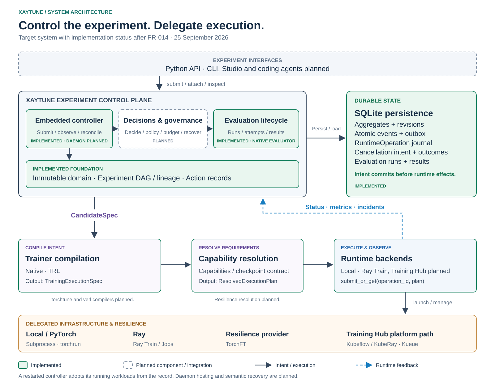

<p align="center">
  
</p>

# Xaytune

**An agent-native experiment control plane for model post-training and adaptation.**

Xaytune is being built to coordinate training, evaluation, branching, recovery,
interventions, experiment lineage, and agent-driven decisions across trainer and
runtime backends. It answers:

> What should this training experiment do next?

**Xaytune controls the experiment.** Trainer integrations compile training intent.
Runtime integrations execute training. Infrastructure schedules and runs workloads.

**[Documentation](https://szaher.github.io/xaytune/)** | **[Examples](https://szaher.github.io/xaytune/examples/)** | **[API Reference](https://szaher.github.io/xaytune/api/)** | **[Architecture specification](xaytune-training-harness-spec/README.md)**

> **Xaytune 2.0 is under active development.** The domain and persistence foundations
> have landed on `main`; Band C, the compile/execute boundary, is current work.
> The end-to-end experiment controller and runtime integrations are not available
> yet. The existing v0.6.0 trainer API remains usable; see
> [Existing training capabilities](#existing-training-capabilities).

## What Xaytune owns

These are the responsibilities of the target control plane. Implementation status
is tracked below.

| Xaytune owns | Xaytune delegates |
|---|---|
| Experiment topology and candidate identity | Tensor execution and distributed training |
| Scientific lineage and provenance | Runtime implementation |
| Evaluation-driven decisions and interventions | Worker management |
| Semantic recovery | Low-level fault tolerance |
| Agent proposals and policy gates | GPU scheduling and infrastructure admission |
| Experiment budgets and execution intent | Kubernetes workload execution |

The integration layers are:

- **Trainer compilers:** Xaytune Native, TRL, torchtune, verl, and future integrations.
- **Runtime backends:** Local, Ray Train, and Training Hub.
- **Infrastructure and resilience providers:** PyTorch/torchrun, TorchFT, Ray,
  Kubeflow Trainer, KubeRay, Kueue, and OpenShift AI deployments.

These describe the planned ecosystem, not an installed-backend support matrix.

## Development status

Status as of **2026-09-22**, after the Band B hardening merged.

### Completed foundation

- Immutable core domain models and lifecycle state machines.
- SQLite persistence, versioned migrations, and revision-based optimistic concurrency.
- Atomic aggregate state, event, and outbox transactions.
- Durable `RuntimeOperation` journal with atomic attempt + submit-intent creation.
- Idempotent persistence boundaries and durable unresolved-operation queries.
- Action substrate and persisted cancellation intent, lifecycle, and outcome semantics.
- Experiment DAG, cycle prevention, lineage traversal, and candidate comparison.
- Crash/rollback and cross-process concurrency tests for the persistence layer.

This establishes **repository recovery**, not a running experiment controller.
Runtime submission, active-workload reattachment, external cancellation delivery,
policy/budget enforcement, and daemon restart reconciliation are later work.

### Current work: Band C — compile/execute boundary

`CandidateSpec`, `TrainingSpec` and the identity framework have landed:
`CandidateFingerprint` is a versioned projection rather than a hash of the
current schema, so adding a field later cannot silently change the identity of
candidates already recorded. `RunHistoryFingerprint` and
`ArtifactLineageFingerprint` separate what a run *did* from what produced its
artifact.

Next is `TrainerCompiler`, `TrainingExecutionSpec` and capability resolution.
Restart-safe LocalRuntime, Native/TRL compiler adapters, the embedded controller,
and runtime-operation reconciliation follow within this band.

<details>
<summary>Foundation implementation history</summary>

Band B landed through [SQLite repository (#18)](https://github.com/szaher/xaytune/pull/18),
[events, outbox, and journal (#19)](https://github.com/szaher/xaytune/pull/19),
[Action substrate (#20)](https://github.com/szaher/xaytune/pull/20),
[experiment graph (#21)](https://github.com/szaher/xaytune/pull/21), and
[persistence hardening (#22)](https://github.com/szaher/xaytune/pull/22).
The [implementation plan](xaytune-training-harness-spec/15-implementation-plan.md)
defines the remaining contracts and acceptance gates.

</details>

## Architecture

The **target architecture** separates scientific intent, compilation, capability
resolution, and execution. Solid green boxes show the implemented foundation;
dashed boxes show planned components. The runtime feedback path is separate
from the path that submits work.



The boundary is **experiment topology, not GPU count**. Xaytune may control a
large distributed training job while the runtime remains responsible for
second-scale worker recovery and distributed tensor execution.

See the [architecture specification](xaytune-training-harness-spec/02-architecture.md)
for protocol and dependency boundaries.

## Roadmap

| Architectural band | Status |
|---|---|
| Domain foundation | Complete; typed candidate/identity contracts continue in Band C |
| B — persistence and control records | Complete |
| C — compile/execute, local runtime, runtime reconciliation | **Current** |
| D — durable evaluation and decisioning | Planned |
| E — policy and budget over the Action substrate | Planned |
| F — checkpoints, semantic recovery, interventions | Planned |
| G — rule-based planner and experiment branching | Planned |
| H — daemon hosting and whole-controller restart | Planned |
| I — LLM planner | Planned |
| J — Ray / TorchFT / Training Hub integrations | Planned |

The [implementation plan](xaytune-training-harness-spec/15-implementation-plan.md)
keeps policy before recovery and runtime reconciliation before daemon hosting.

## Existing training capabilities

Xaytune already contains an opinionated PyTorch-based training stack. The existing
`finetune`, `pretrain`, `align`, `evaluate`, CLI, and deterministic pipeline APIs
remain available during the transition. This stack will become the Native
trainer implementation behind the new compile/execute boundary.

Core SFT and DPO paths are tested and functional. The maturity labels below
refer to this **existing trainer stack**, not to the new control plane.

**Core (tested, recommended for use):**

- **SFT fine-tuning** — full, LoRA, QLoRA with proper prompt masking (only response tokens contribute to loss)
- **Multi-turn conversation masking** — per-turn label masking for chat and ShareGPT formats
- **DPO alignment** — Direct Preference Optimization with response-only log-probability scoring
- **GRPO alignment** — Group Relative Policy Optimization, reference-model-free by default
- **5 data formats** — Alpaca, ShareGPT, OpenAI chat, raw text, preference pairs
- **Multi-stage pipelines** — chain SFT → merge → DPO → eval → export in a single command
- **Evaluation** — built-in metrics (loss, perplexity, token accuracy) + lm-eval-harness benchmarks
- **Export** — merge LoRA adapters, push to HuggingFace Hub
- **Config system** — YAML configs with inheritance, CLI overrides, Pydantic validation
- **Callbacks** — event-driven hooks for checkpointing, early stopping, progress, custom logic
- **4 logging backends** — console, TensorBoard, W&B, MLflow

**Experimental (limitations vary; see [Maturity](#maturity)):**

- **ORPO / SimPO alignment** — implemented with numerically stable loss, needs real-world validation
- **REINFORCE alignment** — vanilla policy gradient, functional but minimal
- **PPO** — value head, rollout buffer, and multi-epoch training; requires online RL
- **Online RL** — generate→score→train pipeline for RL methods
- **DeepSpeed** — partial ZeRO integration; optimizer/scheduler and checkpoint ownership remain open (TASK-029)
- **FSDP** — wrapping with sharding strategy, CPU offload, mixed precision
- **GGUF conversion** — delegates to llama.cpp tools (requires separate installation)
- **Model merging** — Linear, SLERP, TIES, DARE weight interpolation
- **Agent fine-tuning** — tool-use data formats with per-message loss masking
- **Training Studio** — Gradio web UI for configuring and launching runs
- **Data preparation** — generate, filter, deduplicate, convert pipeline

## Install

These commands install the existing training package; they do not provide the
planned end-to-end 2.0 experiment API.

```bash
pip install xaytune
```

Optional extras:

```bash
pip install xaytune[wandb]       # Weights & Biases logging
pip install xaytune[mlflow]      # MLflow logging
pip install xaytune[deepspeed]   # DeepSpeed distributed training
pip install xaytune[eval]        # lm-eval-harness benchmarks
pip install xaytune[studio]      # Training Studio web UI
pip install xaytune[all]         # Everything
```

## Quickstart

The examples below use the existing trainer API.

### Python API

```python
import xaytune

# LoRA fine-tuning (prompt tokens masked, trains on response only)
state = xaytune.finetune(
    model="meta-llama/Llama-3.1-8B",
    dataset="data/train.jsonl",
    method="lora",
    format="alpaca",
    num_epochs=3,
)

# DPO alignment (response-only log-prob scoring)
state = xaytune.align(
    model="output/sft-model",
    dataset="data/preferences.jsonl",
    method="dpo",
    format="preference",
)

# Evaluation
results = xaytune.evaluate(
    model="output/my-model",
    dataset=[{"input_ids": [1, 2], "labels": [1, 2]}],
    metrics=["loss", "perplexity", "token_accuracy"],
)
```

### Multi-Stage Pipeline

Chain training stages in a single command:

```yaml
# pipeline.yaml
name: sft-to-aligned
output_dir: output/pipeline
stages:
  - name: sft
    recipe: finetune
    method: lora
    model_name: "meta-llama/Llama-3.1-8B"
    data: { path: "data/train.jsonl", format: alpaca }
    trainer: { num_epochs: 3, learning_rate: 2e-4 }

  - name: merge
    export: merge

  - name: dpo
    recipe: align
    method: dpo
    data: { path: "data/prefs.jsonl", format: preference }
    trainer: { num_epochs: 1, learning_rate: 5e-6 }

  - name: eval
    eval: { metrics: [loss, perplexity], benchmarks: [mmlu] }
```

```bash
xaytune pipeline --config pipeline.yaml
xaytune pipeline --config pipeline.yaml --dry-run
xaytune pipeline --config pipeline.yaml --resume-from dpo
```

### CLI

```bash
# Train
xaytune train --config configs/examples/lora_finetune.yaml
xaytune train --config configs/examples/lora_finetune.yaml --override model.name=mistralai/Mistral-7B-v0.3

# Evaluate
xaytune eval --model output/my-model --benchmarks mmlu,gsm8k
xaytune eval --model output/my-model --dataset data/eval.jsonl --metrics loss,perplexity

# Export
xaytune export merge --checkpoint output/lora-ckpt --output output/merged
xaytune export push --model output/merged --repo username/my-model

# Distributed training
xaytune launch --config configs/examples/lora_finetune.yaml --nproc-per-node 4

# Training Studio (experimental)
xaytune studio --port 7860
```

### Config file

```yaml
recipe: finetune
method: lora

model:
  name: meta-llama/Llama-3.1-8B

data:
  path: data/train.jsonl
  format: alpaca
  eval_split: 0.05
  packing: true
  max_seq_length: 2048

lora:
  rank: 16
  alpha: 32

trainer:
  batch_size: 4
  learning_rate: 2e-4
  num_epochs: 3
  mixed_precision: bf16
  checkpoint_every_n_steps: 500

eval:
  every_n_steps: 500
  metrics: [loss, perplexity]

logging:
  backends: [console, tensorboard]
```

## Recipes

| Recipe | Methods | Use case |
|--------|---------|----------|
| `finetune` | `full`, `lora`, `qlora` | Supervised fine-tuning on instruction data |
| `pretrain` | `full` | Pre-training or continued pre-training on raw text |
| `align` | `dpo`, `grpo` | Alignment with human preferences (recommended) |
| `align` | `orpo`, `simpo`, `reinforce`, `ppo` | Alignment (experimental — see [Maturity](#maturity)) |

## Maturity

| Feature | Status | Notes |
|---------|--------|-------|
| SFT (full/LoRA) | **Stable** | Prompt masking, multi-turn, sequence packing |
| QLoRA | **Stable** | Uses `prepare_model_for_kbit_training` |
| DPO | **Stable** | Response-only log-probs, frozen reference model |
| GRPO | **Stable** | Reference-model-free, optional KL via `kl_coeff` |
| Multi-stage pipeline | **Stable** | Sequential chaining with auto-inheritance |
| Evaluation | **Stable** | Metrics + lm-eval benchmarks |
| Export (merge, Hub push) | **Stable** | LoRA merge, HF Hub push |
| Config system | **Stable** | YAML, inheritance, Pydantic validation |
| Callbacks + logging | **Stable** | 4 backends, exception isolation |
| ORPO | **Experimental** | Numerically stable, needs real-world validation |
| SimPO | **Experimental** | Length-normalized, reference-free |
| REINFORCE | **Experimental** | Vanilla policy gradient |
| PPO | **Experimental** | Full PPO trainer with value head, rollout buffer, multi-epoch training. Requires `online_rl.enabled=True` |
| DeepSpeed | **Experimental / partial** | Optimizer/scheduler and checkpoint ownership remain open; see [TASK-029](implementation-plan/backlog.md#task-029-is-still-open) |
| FSDP | **Experimental** | Sharding, offload, mixed precision wrapping |
| GGUF export | **Experimental** | Requires llama.cpp tools installed separately |
| Model merging | **Experimental** | TIES, DARE, SLERP, linear interpolation |
| Agent fine-tuning | **Experimental** | Tool-use formats with per-message masking |
| Training Studio | **Experimental** | Gradio UI for job configuration and launch |
| Data preparation | **Experimental** | Generate, filter, deduplicate, convert |
| Online RL | **Experimental** | Generate→score→train for RL methods |

## Extensibility

Register custom components with decorators:

```python
from xaytune.data import register_format
from xaytune.eval import register_metric
from xaytune.recipes.align.rewards import register_reward
from xaytune.trainer import on

@register_format("my-format")
def parse_my_data(sample):
    return {"text": f"Q: {sample['q']}\nA: {sample['a']}"}

@register_metric("domain-accuracy")
def domain_accuracy(predictions, references, **kwargs):
    return sum(p == r for p, r in zip(predictions, references)) / len(predictions)

@register_reward("brevity")
def brevity_reward(prompt, response, *, max_len=100):
    return 1.0 if len(response) <= max_len else 0.0

@on("step_end")
def log_memory(state):
    print(f"Step {state.global_step}: loss={state.metrics.get('loss', 'N/A')}")
```

## License

Apache 2.0
