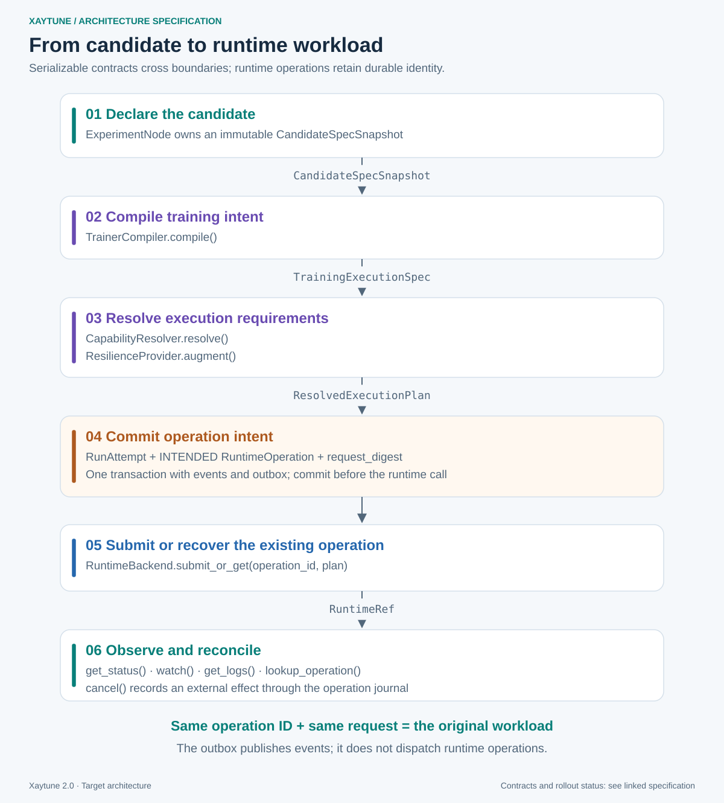
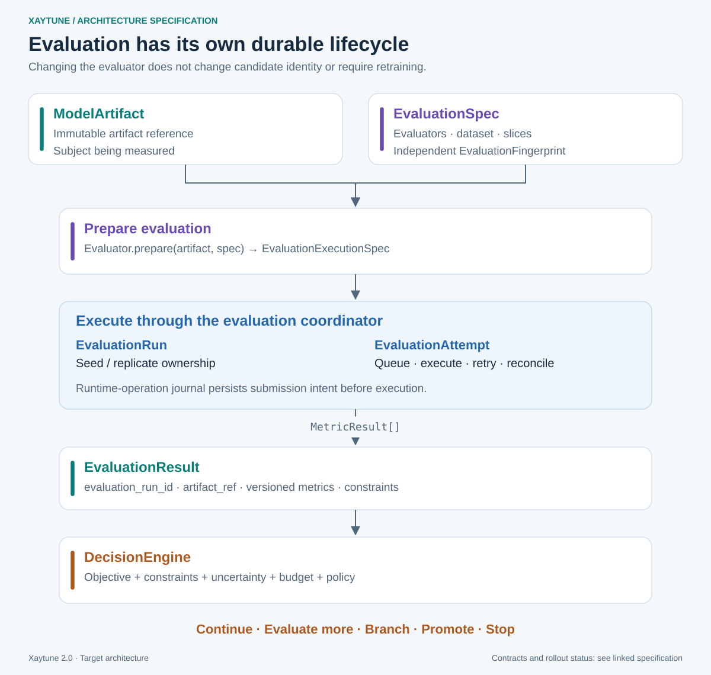
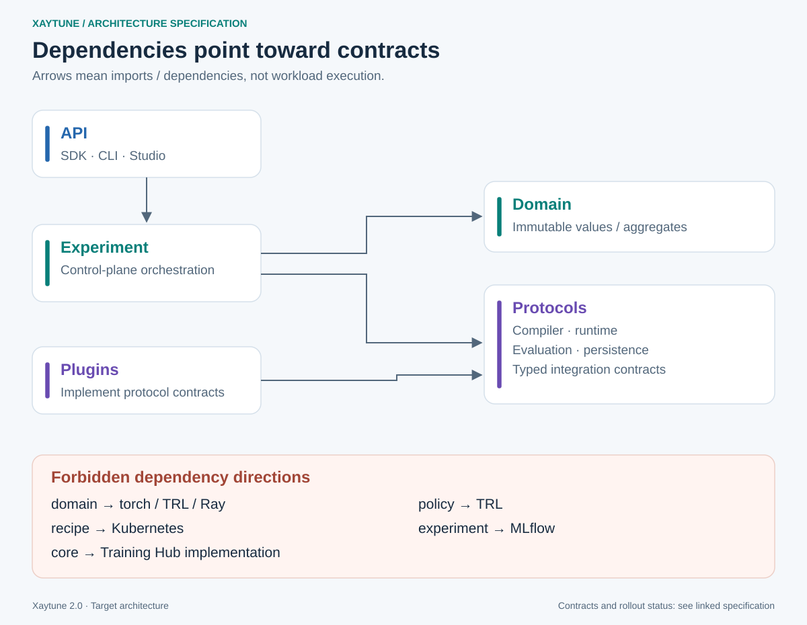

# Target Architecture

## 1. Top-level layers


## 2. Control-plane components

### ExperimentController

Coordinates the experiment.

Responsibilities:

- load/reconcile durable experiment state
- request plans
- validate actions
- reserve budget
- create nodes/runs/attempts
- compile training
- submit runtime workload
- observe runtime
- request evaluation
- invoke decision engine
- invoke recovery engine
- persist transitions atomically
- resume after controller restart

The controller must be restartable.

### ExperimentGraph

Stores scientific lineage.

A node is a candidate/hypothesis, not an infrastructure attempt.

### Planner

Proposes new scientific candidates.

Providers:

- RuleBasedPlanner
- LLMPlanner
- SearchProvider adapters
  - Ray Tune
  - Optuna
  - Katib

### PolicyEngine

Deterministically validates an action against:

- allow/deny rules
- user policy
- organization policy
- capability constraints
- budget
- human approval requirements

### BudgetLedger

Tracks:

- reserved
- committed
- consumed
- released

Budget must support parallel candidates without overcommitting resources.

### EvaluationCoordinator

Schedules independent evaluation workloads and collects versioned metric results.

### DecisionEngine

Turns evaluation + objective + constraints + budget + history into a decision.

### RecoveryCoordinator

Determines whether an incident should:

- retry
- resume
- rollback
- use runtime-native recovery
- apply an execution override (operational, intent-preserving — ADR-011)
- apply a training intervention (scientific, on the continuing trajectory —
  ADR-011; this is the outcome of an approved Action, so it requires policy
  authorization even during recovery)
- create a new experiment node (only when the result is an *alternative to
  compare against*, not a continuation)
- pause
- fail

## 3. Execution path



The controller observes the runtime using:

```text
get_status()
watch()
get_logs()
cancel()
lookup_operation()
```

## 4. Evaluation path



Evaluation changes do not mutate `CandidateFingerprint` (ADR-006, ADR-011).

## 5. Search path

Search providers do not execute workloads directly through Xaytune internals.

They provide candidate suggestions:

```python
CandidateProposal(
    base_node_id="node-12",
    hypothesis="Explore LR and warmup around current best candidate.",
    mutations=[...],
    origin=SearchOrigin(
        provider="ray-tune",
        trial_id="..."
    ),
)
```

Xaytune creates nodes and records lineage.

## 6. Dependency direction



## 7. Core package boundary

`xaytune.core` must have no dependency on:

- torch
- transformers
- peft
- trl
- torchtune
- verl
- ray
- torchft
- kubernetes
- mlflow
- wandb

Integration packages/modules are optional imports.

## 8. Recommended package architecture

```text
xaytune/
  core/
    ids.py
    domain/
    events/
    state/
    errors.py
    capabilities.py
    protocols.py

  experiment/
    controller.py
    graph.py
    planner.py
    decision.py
    reconciliation.py

  compilation/
    base.py
    resolver.py

  trainers/
    native/
    trl/
    torchtune/
    verl/

  runtimes/
    local/
    ray/
    training_hub/

  resilience/
    incidents/
    detectors/
    policies/
    recovery/
    providers/

  checkpoint/
    codec/
    store/
    manager.py

  evaluation/
    base.py
    metrics/
    lm_eval/
    agent/

  policy/
    engine.py
    rules.py

  budget/
    ledger.py

  storage/
    sqlite/
    filesystem/

  agents/
    base.py
    rule_based.py
    llm/

  search/
    base.py
    ray_tune.py
    optuna.py
    katib.py

  observability/
    console.py
    mlflow.py
    wandb.py

  compatibility/
    legacy_api.py
    legacy_callbacks.py

  cli/
  studio/
```
