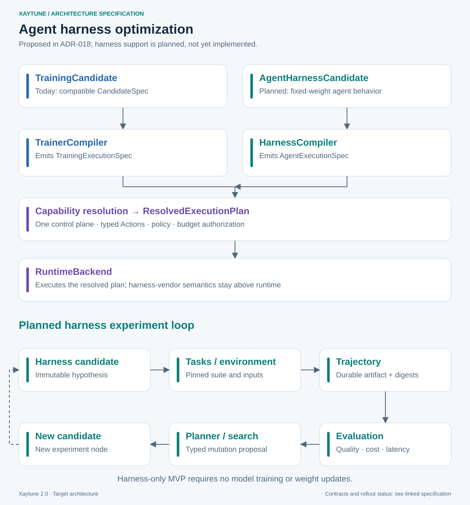

# Agent Harness Optimization

> **Planned; not yet implemented.** This chapter proposes another experiment
> type in the existing control plane. [ADR-018](adrs/ADR-018-agent-harness-candidates.md)
> remains `Proposed`. Names and schemas below are conceptual contracts, not
> public APIs or persistence schemas. The H track in the
> [implementation plan](15-implementation-plan.md#harness-optimization-track-planned)
> schedules future work; this specification authorizes no implementation.

## 1. Product scope

Xaytune should support experiments that optimize how an agent operates while
keeping model weights fixed. This is **Agent Harness Optimization**, separate
from **Agent Training**, which optimizes model weights through SFT, DPO, GRPO,
PPO/RL or agent-environment training.

| | Model training optimization | Agent harness optimization |
|---|---|---|
| Input | Model + data + training recipe | Model reference + harness + tasks/environment |
| Mutations | LR, optimizer, data mixture, reward, adapter configuration | Prompts, tools, context, memory, delegation, middleware, routing, stopping |
| Output | Trained model artifact | Harness configuration and/or implementation artifact |
| Weight updates | Part of the experiment | Not required; fixed weights in the first MVP |

The harness is the system around model calls: instructions, tool interfaces,
context construction, compaction, observation filtering, retrieval, memory,
subagents, middleware, retries, model routing and stopping rules. Xaytune
controls comparisons and lineage; it does not become a general-purpose agent shell.

Three future modes are distinct:

- **A. Training-only:** the existing training candidate and compiler path.
- **B. Harness-only:** optimize an agent using an existing model without training
  or modifying that model.
- **C. Joint:** compose a training candidate and harness candidate in one
  experiment. This is later work, not a requirement for the harness MVP.

```text
model candidate + harness candidate → joint experiment
```

Full Cartesian-product execution, joint scheduling and joint search spaces are
intentionally deferred.

## 2. Candidate generalization and compatibility

Today, `CandidateSpec` is the immutable **training** scientific proposition:
model, data, training, optional reward, environment and schedule. Preserve that
class, its imports, constructors, serialization readers and v1/v2 identity
projections. Do not nest an `AgentHarnessSpec` inside it or require dummy
training/data fields for a harness experiment.

The proposed future representation is a **versioned candidate envelope whose
payload is a discriminated union**:

```text
ExperimentCandidate (versioned envelope)
  kind: CandidateKind = TRAINING | AGENT_HARNESS
  payload:
    TrainingCandidateSpec       (existing CandidateSpec through compatibility)
    | AgentHarnessCandidateSpec

AgentHarnessCandidateSpec
  harness: AgentHarnessSpec
  environment_contract: resolved BehaviorEnvironmentContract? (scientific role only)
```

The candidate's optional `environment_contract` covers behavior-affecting
interfaces/environment semantics when they are part of the hypothesis. It does
not contain benchmark membership, held-out tasks or scoring configuration.
`BenchmarkSuiteRef` and task sampling/scoring configuration attach separately
to the evaluation/comparison specification. These are conceptual roles, not
concrete H02 wire schemas.

The names remain subject to review. The discriminator describes experiment
kind, not the training algorithm. A training payload may still select SFT or
GRPO through its existing training kind. Unknown envelope versions or kinds
must fail explicitly rather than default to training.

Staged migration, **not implemented by this PR**:

1. **Today:** `CandidateSpec == training candidate`; existing APIs and durable
   records remain unchanged.
2. **Future compatibility boundary:** introduce the envelope and explicit kind.
   Recognize existing unwrapped records as training through their established
   versioned readers. Wrapping does not rehash historical candidates, imply
   stronger v1/v2 equivalence, or rewrite stored identities.
3. **Future harness path:** add a separately versioned harness payload and
   scientific fingerprint. Dispatch validation and compilation by kind.
4. **Later:** planner interfaces consume candidate proposals by kind. Any
   storage/API evolution needs its own reviewed migration and compatibility
   tests before deployment; deprecation or renaming is a separate decision.

Generic planners should handle objective, graph and proposal metadata without
assuming every payload has `training.optimization`. Typed mutation providers
may specialize by candidate kind. Recovery work continues with current types.

## 3. AgentHarnessSpec

The conceptual schema is typed, versioned and deeply immutable. Each section
has explicit types, validated defaults and a versioned scientific projection;
the outline below is not an unrestricted dictionary extension mechanism.

```text
AgentHarnessSpec (schema version + identity projection version)
  model
    provider/model reference, pinned revision or artifact digest
    generation settings; reasoning/thinking configuration
  instructions
    system prompt; task prompt template; policy/instruction modules
  tools
    enabled tool IDs; versioned implementations; schemas; descriptions
    requested typed permissions/capabilities
  context
    token/context budget; selection; compaction strategy
    observation filtering; retrieval policy and pinned retrieval sources
  memory
    type; persistence scope; initial snapshot reference
    retrieval/update policy; isolation/reset policy
  orchestration
    single/multi-agent; subagent definitions and model references
    delegation policy; handoff strategy; behavior-relevant concurrency
  middleware
    tool-call transforms; validation; retry/error handling; hooks
  routing
    model selection; fallback/routing policy; pinned route targets
  stopping
    per-task max turns/tokens/cost; success/termination policy
  implementation
    optional versioned, content-addressed harness/code artifact reference
```

Prompts and schemas may be inline bounded values or immutable artifact
references. Custom implementations, templates, hooks, memory policies and
tools use versioned artifact references with content digests and contract
versions. Raw closures, live Python objects, loaded models and mutable paths
cannot enter durable candidate identity. Core does not depend on the artifact's
implementation language. Repository URL plus a moving branch is insufficient.

Agent memory is an experimental input/state, distinct from Xaytune's experiment
memory. Start replicates from the same pinned snapshot or declared empty state;
never silently share updates across candidates. A deliberate initial-memory
change is scientific. Updates produced by a declared policy during execution
belong to that run's trajectory and output lineage.

Prompts called "policy modules" are instructions to the agent, not authority
over Xaytune's PolicyEngine or connector permissions.

## 4. Scientific identity and other identities

`HarnessFingerprint` identifies the resolved scientific harness proposition.
Use a domain-separated, versioned canonical typed projection following the
existing fingerprint principles, not a hash of arbitrary object serialization.
Resolve behavior-relevant references before computing a comparable identity.

Its projection covers model/provider semantics, pinned model revisions and
generation/reasoning configuration; instructions; enabled tools, tool artifacts,
schemas, descriptions and requested capabilities; context and retrieval;
memory policy and initial state; orchestration/delegation; middleware; routing;
stopping; behavior-defining code artifacts; and the explicitly scientific
`BehaviorEnvironmentContract`, when present. Stable subagent ordering and
default normalization must be specified before H02 ships. Seeds and replicate numbers remain realization identity.

**Proposed model decision:** include the resolved model binding in
`HarnessFingerprint` for harness-only experiments, even when every candidate
uses the same model. Also retain its separate subject reference for provenance
and later composition. Never omit a model binding because it was "fixed" in a
search configuration; results still depend on it. Every fallback/subagent model
is likewise bound. A provider alias without a verifiable revision cannot claim
reproducibility: record resolution evidence and constrain comparison/reuse or
refuse it under the experiment's reproducibility policy.

| Identity | Question answered / contents |
|---|---|
| HarnessFingerprint | Which scientific harness proposition? Behavior configuration and resolved scientific inputs |
| ExecutionFingerprint | How was it executed? Compiler/adapter version, runtime, machine/topology, container, dependencies, transport/provider client implementation |
| EvaluationFingerprint | How was it measured? Resolved scoring spec, benchmark inputs, evaluator/rubric/judge versions and configuration; not the subject or sample seed |
| Trajectory / RunHistory fingerprint | What happened? Run/replicate identity, ordered event/chunk digests, retries, failures and discarded work; provisional until terminal |
| Artifact lineage | Which causal history produced this output? Producer, retained task trajectories and input/output ancestry; distinct from full audit history |
| Runtime request digest | Is this the same submit/cancel request? The whole resolved plan and operation type, as in ADR-013; never substituted by a scientific hash |

A different machine, container packaging, provider client or adapter glue that
preserves the hypothesis changes execution identity. A middleware/tool/code
change that alters the tested behavior changes scientific identity. Distinguish
behavior-defining artifacts from execution implementation artifacts explicitly;
record both. An unclassified semantic change must not masquerade as operational.
Execution differences are not statistically interchangeable by fingerprint alone.

`BehaviorEnvironmentContract` identifies behavior-facing tool/action/observation
interfaces, reset semantics and environment behavior that form part of the
hypothesis. Agent-visible retrieval/environment state enters scientific identity
only when it is behavior-defining; pin its reference and declare that role.
Benchmark sample membership, held-out inputs, sampling and scoring normally
belong to evaluation/comparison identity. Ordinary benchmark task inputs are
variable test instances under the contract; different observations or answers
on those instances do not by themselves define a new harness hypothesis.

**Invariant: same harness + different benchmark normally remains the same
HarnessFingerprint and gets a different EvaluationFingerprint/comparison cohort.**
Rescoring likewise does not create a new harness candidate. If a task/environment
input is explicitly declared part of the scientific hypothesis or changes
agent-visible behavior rather than merely supplying another benchmark sample,
its pinned reference may also enter HarnessFingerprint. Record the scientific
and evaluation roles explicitly; suite membership alone never supplies an
implicit scientific binding.

## 5. Nodes, runs and attempts

- A prompt, tool description/set, context policy, model binding, behavior code,
  delegation or stopping mutation proposed as a comparative alternative creates
  a new `ExperimentNode` and immutable harness snapshot.
- Executing the same proposition again creates a new `Run` with seed/replicate
  metadata. Evaluating an existing trajectory again creates an `EvaluationRun`.
- Infrastructure retry creates a new `RunAttempt` on the same run. An approved
  operational adjustment preserving behavior affects execution identity, not
  scientific identity or node count.

Declared dynamic routing, memory updates and compaction are realizations of
the candidate policy; record them as events, not new nodes. The first harness
MVP does not mutate scientific configuration mid-task. A future adaptive
in-run harness intervention requires its own reviewed comparability and
lineage contract; do not reuse `TrainingIntervention` for it implicitly.
ADR-011's existing training continuation rules remain intact.

## 6. Compilation and execution boundary



```text
TrainingCandidate (today: CandidateSpec)
  → TrainerCompiler → TrainingExecutionSpec
  → capability resolution → ResolvedExecutionPlan → RuntimeBackend

AgentHarnessCandidate (planned)
  → HarnessCompiler → AgentExecutionSpec
  → capability resolution → ResolvedExecutionPlan → RuntimeBackend
```

Choose a sibling `HarnessCompiler`, reusing the existing compile/resolve/execute
architecture. It advertises versioned capabilities, checks support with reasons,
and deterministically compiles the complete resolved candidate and explicit
compilation context. Compilation never launches an agent, calls its model,
performs a task or submits a workload. Reference resolution is a prior recorded
step; compilation does not read mutable inputs or hidden globals.

`AgentExecutionSpec` is a future sibling workload spec, not a harness disguised
as `TrainingExecutionSpec`. It carries entrypoint, arguments/config, pinned
artifact inputs, outputs, resources, secret references, required capabilities,
telemetry contract and harness identity. Seeds, replicate assignments and task
selections are explicit execution context. Resolution produces the same kind
of durable, reviewable plan and operation-intent flow used today.

**RuntimeBackend must not learn Pi/Codex/Claude Code/OpenCode/Hermes semantics.**
Harness translation and trajectory normalization belong above runtime, in
compiler/adapter and worker packages. Runtime executes a resolved plan,
attributes reports, reconciles operations and enforces its sandbox contract.

Likely optional adapters: `PiHarnessAdapter`, `CodexHarnessAdapter`,
`ClaudeCodeHarnessAdapter`, `OpenCodeHarnessAdapter`, `HermesHarnessAdapter`
and custom production-agent adapters. Adapter support must be explicit and
refuse unsupported settings rather than silently drop a mutation.

Current `ExecutionSpec` and target/telemetry dispatch support training and
evaluation only. This proposal does not claim existing runtimes can submit a
harness workload today. H03 must review versioned workload/target/telemetry
extensions and preserve historical plan/request digests, using generic dispatch
rather than vendor branches in runtime.

## 7. Repeatable tasks and environments

Propose versioned `BehaviorEnvironmentContract`, `TaskSpec` and
`BenchmarkSuiteRef` abstractions, independent of any named benchmark. Providers
can describe coding, tool-use, browser/terminal, customer-support,
agent-environment and custom suites. Keep their identity roles separate:

| Role | Contents / attachment |
|---|---|
| Candidate/scientific | AgentHarnessSpec plus an optional BehaviorEnvironmentContract for behavior-affecting tool/action/observation/reset semantics; explicitly scientific agent-visible retrieval/environment state |
| Evaluation/comparison | BenchmarkSuiteRef, ordered task/sample membership, held-out inputs, task sampling policy/assignments, scoring rules/rubric and evaluator/judge configuration |

Behavior contracts describe interfaces and semantics, not which benchmark
samples are selected or how outputs are graded. A task spec describes its
inputs, output artifacts and evaluation contract; each task has a stable
namespaced ID plus resolved revision and content digest. Suite manifests pin
ordered task membership, input digests, fixtures, environment snapshots and
provider/contract versions. Any behavior-defining snapshot shared with the
candidate is explicitly bound in its scientific role, not inherited implicitly
from the benchmark reference. Sampling policy belongs to the evaluation spec;
concrete task assignments and seeds remain run/comparison provenance, outside
HarnessFingerprint. Task IDs alone do not prove unchanged contents. Dynamic
services need snapshot/replay evidence or an explicit weaker reproducibility
declaration.

Follow Xaytune's evaluation-resolution principle: retain requested and resolved
specifications; pin mutable branches, dataset aliases and benchmark inputs before
comparison; validate support again after resolution; persist the resolved
manifest and compile from it. Verify localized bytes against digests. Do not
change a previously pinned suite silently when an upstream alias moves.

Candidate comparisons use the same pinned suite, task sampling/reset policy,
measurement units and declared execution comparability constraints. A suite
change starts a separate comparison cohort. Keep held-out scoring inputs outside
mutation-provider access unless the experiment explicitly permits their use.

## 8. Durable trajectory and provenance

Harness execution produces a versioned trajectory manifest and immutable
artifact references to bounded event chunks, outputs and optional replay inputs.
Core domain rows store typed metadata, producer IDs, digests and references,
not unlimited raw contexts or logs. Reuse existing artifact/storage abstractions;
the future durable layout, chunk format and retention policy are H05 decisions,
not a migration in this PR.

Record enough structured evidence to evaluate and explain the execution:

```text
experiment/node/run/attempt and task IDs, task input digest
harness and execution fingerprints; model/provider/revision evidence
ordered turns, model calls, tool calls and typed/redacted results
delegations/handoffs; context selection and compaction events
memory/retrieval inputs and updates; output/artifact references
input/output token use, context use, cost, latency
errors, retries, termination reason and completeness metadata
compiler/adapter/worker versions; seed/replicate and reset evidence
```

Events have stable IDs, sequence and causal links for deduplication and attempt
attribution. Final manifests bind chunk digests and output lineage to their
producer. Missing or redacted evidence is explicit; it cannot imply full replay
or provider-level determinism. Reconnecting telemetry does not create a retry.

Record mutation provenance as well: parent node/fingerprint, typed patch,
old/new artifact digests, rationale, provider/version, search state/trial ID,
generation model/prompt when applicable, source evaluation IDs,
candidate-governance records and any applicable approval/action IDs, and resulting
candidate fingerprint. A proposal is not evidence of execution.

Secrets remain secret references. Sensitive tool outputs use redaction and
access-controlled artifact storage with declared retention; sanitize before
publishing ordinary trajectory chunks. Digests attest retained content, not an
unrecorded complete transcript. Tool outputs, retrieved instructions and model
text are untrusted observations and must not automatically become experiment
memory, executable instructions or permission grants. Any memory ingestion is
an explicit typed, policy-controlled transformation with provenance.

## 9. Evaluation and independent objectives

Evaluate trajectory/output artifacts through the existing independent evaluator
and `EvaluationRun`/`EvaluationAttempt` lifecycle. Harness execution produces
the subject; evaluation measures it. These are separate workloads even if a
task provider supplies a scoring implementation. Reuse is subject digest plus
evaluation identity and determinism policy, never harness fingerprint alone.

| Metric family | Minimum measures |
|---|---|
| Outcome | Task success/correctness; quality score with rubric/version |
| Cost | Monetary cost with currency, rate-source/version and accounting scope |
| Tokens | Input/output tokens separately; cached/reasoning tokens when available |
| Time | Latency with units, measurement boundaries and per-task distributions |
| Interaction | Number of turns; tool-call count; tool failures; retries |
| Context | Used/peak context tokens, budget utilization and compaction counts |

Metrics retain per-task observations, evaluator/version, sample count, slice,
units, missingness, uncertainty and aggregation method. Zero is not a substitute
for unavailable cost/token/provider data. Account for failed attempts and retries
in total resource spend; distinguish successful-task latency from total elapsed
time. The budget ledger records spend even when a trajectory fails evaluation.

Support deterministic, rule-based and benchmark-defined scoring, plus optional
LLM judges with pinned model/provider/revision, prompt, rubric and generation
settings recorded in evaluation provenance. Multiple evaluators are separate
evaluation runs in one cycle, preserving their determinism declarations.

Stochastic harness **execution** replicates are new runs of the same candidate,
with explicit seed/replicate and per-task assignment/reset evidence, yielding
distinct trajectories. Retrying a failed attempt is not an independent sample.
Stochastic **judging** replicates are distinct evaluation runs of the same
trajectory/spec. Distinguish both variance sources; a fixed seed does not claim
provider determinism. Never satisfy a replicate request with a cached sample.

Keep quality, success, cost, tokens and latency as independent metrics/objectives.
A planner/search provider may propose scalarization, constraints or Pareto
dominance, recording weights, normalization, directions and comparison cohort.
Preserve the raw vector and uncertainty. The current single-primary Objective
and threshold engine remain unchanged; native multi-objective selection is
future H06/planner work, not support implied by this specification.

## 10. Mutation and search plugin boundaries

`HarnessMutationProvider` proposes typed, validated changes to an immutable
candidate; `HarnessSearchProvider` selects proposals from a declared search
space using graph/history, multi-objective evidence and remaining budget. Both
are future versioned plugin boundaries. Neither executes workloads or changes
durable experiment state directly.

Mutation surfaces include prompts; tool descriptions/schemas and enabled tool
sets; context selection/compaction; memory; delegation; middleware; routing;
and model/generation configuration. A patch names its base fingerprint, typed
field/artifact change and rationale. Reject stale bases, unknown fields,
unsupported adapter settings and policy-denied capabilities before scheduling.

Possible providers include random/grid baselines, Optuna, evolutionary and
Pareto/evolutionary search, reflection-based mutation, an LLM planner,
GEPA/MIPRO-style prompt optimization and external harness optimizers. These are
examples, not selected dependencies or implemented integrations. Optimizer
state and provenance are durable artifact references for restart/audit.

Preserve the [chapter 09](09-agent-planner-policy-budget.md#2-planner-protocol)
planner contract: `Planner → CandidateProposal | ActionProposal`.
HarnessMutationProvider/SearchProvider may produce a typed `CandidateProposal`
for a new comparative harness alternative. The controller validates it, checks
budget and applies the generic candidate/branching governance contract before
creating a new `ExperimentNode` in the existing experiment graph.

Actual Actions, including permission grants, connector/tool authorization and
operational changes, use `ActionProposal → ActionSpec → PolicyEngine/approval`.
PolicyEngine currently governs ActionSpec, not arbitrary CandidateProposal.
Candidate creation does not already have an Action-based governance contract.

**PR-025/H07 must settle candidate-proposal governance before harness mutation
execution.** A future `BranchExperiment` Action is one possible design, not a
decision made here. Generated candidates still require validation, budget checks
and whatever governance the generic branching contract defines. Search remains
replaceable; both proposal paths use one controller, decision engine, experiment
graph and execution system.

## 11. Safety and policy

Generated candidates require candidate validation, budget checks and the generic
branching governance settled by PR-025/H07. Their execution remains constrained
by explicit tool permissions, connector trust boundaries, runtime sandboxing,
applicable human approvals and cost/budget enforcement. CandidateProposal is
not implicitly an Action or an input to PolicyEngine.

Prompt text cannot grant capabilities. A candidate may request a tool set within
existing grants; a new permission grant or connector/tool authorization requires
an explicit typed ActionProposal/ActionSpec through PolicyEngine and approval
where required. A candidate proposal cannot authorize its own requested tools.
Operational changes and other actual Actions retain that same governed path.

Effective permissions are resolved outside the prompt and recorded with the
plan/trajectory. If policy denies a required capability, reject the candidate
or propose a new explicit variant; do not silently execute a different tool
set under the original scientific claim. Capability advertisements describe
technical support, not authorization. Instruction modules and hooks cannot
override either distinction.

Per-task cost/token/turn limits in the harness are scientific stopping rules.
Experiment-wide spending/concurrency limits and organizational ceilings remain
external policy/budget controls. The stricter authorized limit governs; a
budget-forced termination is recorded as such, not task success. Requested
behavioral concurrency differs from runtime resource allocation that preserves
it. Reject variants whose semantic requirements cannot be enforced.

## 12. Reuse of the control plane and roadmap

| Existing component | Harness use |
|---|---|
| Experiment / Node / Run / Attempt | Objective, scientific variants, replicates, operational retries |
| Experiment graph / provenance | Parentage, mutation rationale and artifact lineage |
| Evaluation / decision engine | Trajectory scoring, uncertainty and comparison decisions |
| Planner / search | Proposals and branching through the same controller |
| Action / policy | Actual Actions, permission/connector authorization and applicable approvals; candidate branching governance remains a PR-025/H07 decision |
| Budget ledger | Candidate/run resource checks and accounting across both proposal paths |
| Artifact storage | Harness/code, pinned tasks, trajectories, reports and search state |
| Runtime abstraction | Resolved plans, operation identity and reconciliation |

The planned H01–H12 track is listed in
[chapter 15](15-implementation-plan.md#harness-optimization-track-planned).
H01 is this proposed ADR/spec. H02 onward requires architectural acceptance
and the generic experiment/planner/branching foundation. Recovery is not delayed
or reordered: PR-019 RecoveryPlan/coordinator, PR-020 adaptive OOM recovery,
PR-021 numerical recovery, then PR-024 RuleBasedPlanner, PR-025 branching and
PR-026 adaptive MVP remain the current sequence.

The first harness MVP compares prompts, context policy and tool descriptions/
configuration within an already authorized fixed tool set, against a small
pinned, isolated task suite. It must record replicate trajectories, separate
success/quality/cost/token/latency evidence, policy decisions and lineage, and
return a reproducible harness artifact using the same control plane. Middleware,
delegation, persistent memory and joint optimization expand later.

## 13. Review questions and implementation gates

[ADR-018](adrs/ADR-018-agent-harness-candidates.md) records the proposed answers
and unresolved decisions. Before the corresponding implementation steps:

- H02 must settle concrete envelope naming/version negotiation, historical
  training projection handling and harness canonicalization/defaults.
- H03 must settle workload target/state/telemetry versioning and what adapter
  equivalence evidence permits execution comparisons.
- H04/H05 must settle non-snapshot environments, trajectory chunking/replay and
  security/retention requirements without claiming unavailable reproducibility.
- H06/H07 must settle replicate aggregation, objective contract evolution and
  optimizer capabilities; reuse policy remains separately governed by ADR-017.
- PR-025/H07 must settle candidate-proposal governance before harness mutation
  execution, preserving CandidateProposal and ActionProposal as distinct paths.
- Joint mode must resolve trained artifact/model binding and composed identity
  before scheduling any joint search. No Cartesian-product design is frozen here.
