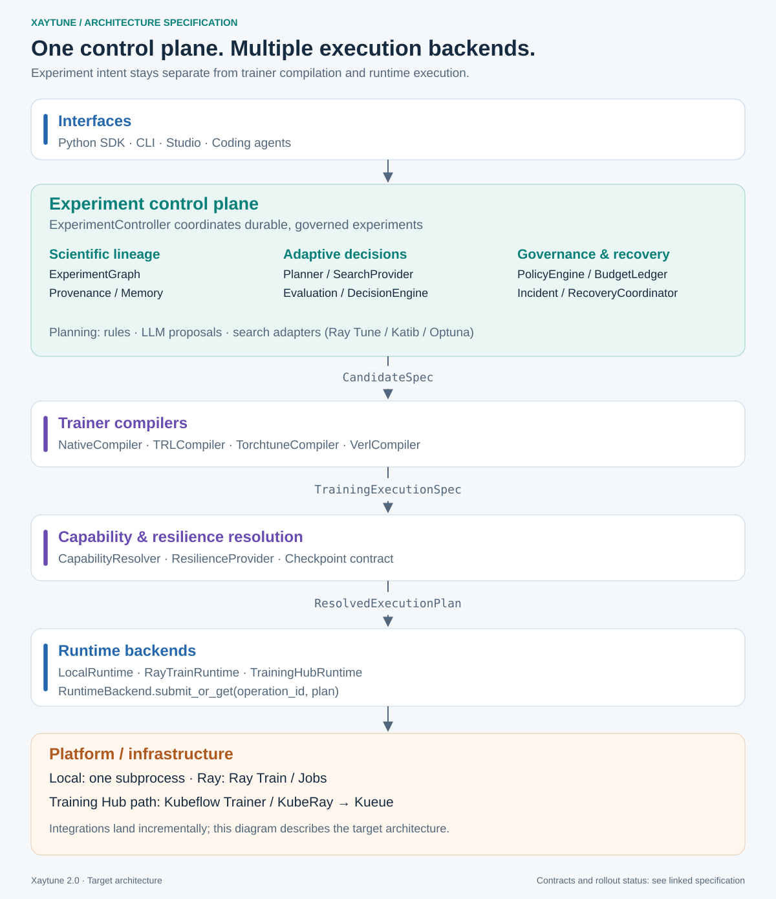
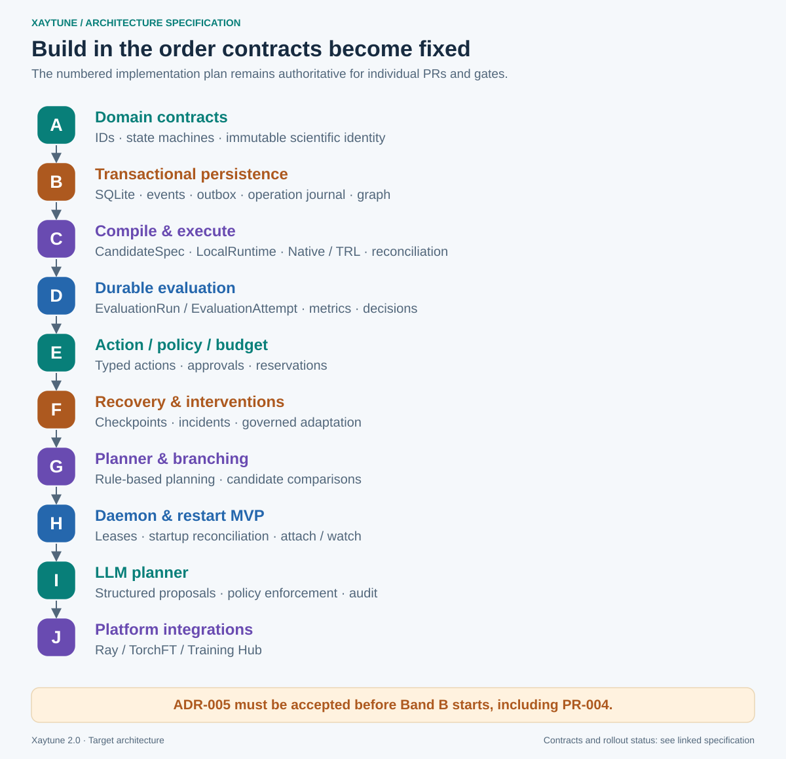

# Xaytune 2.0 — Agent-Native Experiment Control Plane

This package is the implementation specification for evolving Xaytune from an opinionated model training/fine-tuning library into an **agent-native experiment control plane for model post-training and model adaptation**.

"Training harness" remains a fair secondary description, but it is not the primary one: it invites the reading that Xaytune competes with the training runtime, when Xaytune's job is to decide *what to run and what to do about the result*, and to delegate execution to Ray, TorchFT, Training Hub or a local process.

The design assumes the current Xaytune repository continues to exist and is evolved incrementally. Existing recipes, trainer loop, callbacks, checkpointing, evaluation, pipelines, logging backends, CLI, Studio, and plugin discovery are treated as assets to be refactored behind new control-plane boundaries.

## Product definition

**User-facing:** Xaytune is an agent-native experiment control plane for model
post-training. It coordinates training, evaluation, adaptation, recovery and experiment
lineage across trainer and runtime backends.

**Internal architectural definition:** Xaytune is an experiment control plane that compiles training intent into serializable execution plans, delegates execution to runtimes, observes the result, evaluates it, applies policy and budget constraints, and decides what should happen next.

The governing rule is:

> Xaytune controls the experiment. Trainer integrations compile training intent. Runtime integrations execute training.

## What Xaytune is not

**Xaytune is not a frontier-scale pretraining runtime.** It does not replace PyTorch
distributed, TorchFT, Ray Train, Slurm, Kubernetes, Kubeflow Trainer, Kueue or any
proprietary training runtime. Those systems execute workloads. Xaytune controls the
experiments around them.

The boundary is experiment topology, not a GPU count. Xaytune is optimized for work
shaped like this:

```text
many candidates -> train -> evaluate -> compare -> branch -> repeat
```

which covers SFT, DPO/GRPO/PPO, reward tuning, data-mixture experiments, agent training,
synthetic-data loops, adapter and full fine-tuning, and smaller continued-pretraining
jobs. It can submit large distributed jobs wherever the runtime can execute them.

It is *not* built for the other shape — a single months-long foundation-model
pretraining run whose hard problems are second-scale in-band fault tolerance, collective
membership recovery and topology repair. Those belong in the runtime, not in a control
plane. Xaytune owns semantic recovery ("this workload has OOMed three times after worker
replacement, so infrastructure retry is not solving it"), not distributed-systems fault
tolerance.

## Why this exists

Modern model training uses multiple systems:

- PyTorch
- Transformers / PEFT
- TRL
- torchtune
- verl
- TorchFT
- Ray Train
- Ray Tune
- Kubeflow Trainer
- Kueue
- Training Hub
- MLflow / W&B

Each solves part of the problem. Xaytune owns the missing cross-cutting control layer:

- experiment semantics
- scientific lineage
- execution lineage
- agentic experiment planning
- adaptive training decisions
- resilience and recovery policy
- evaluation-driven branching
- budgets and policy enforcement
- provenance
- durable controller state
- runtime-neutral training intent
- capability negotiation

## Architecture at a glance



## Package contents

- `01-product-and-scope.md` — product definition, scope, non-goals, invariants
- `02-architecture.md` — target architecture and boundaries
- `03-domain-model.md` — Experiment, Node, Run, Attempt, Action, Incident, artifacts
- `04-state-machines.md` — separate lifecycle state machines and transitions
- `05-training-spec-and-compilation.md` — CandidateSpec/TrainingSpec ownership, TrainerCompiler, TrainingExecutionSpec
- `06-runtime-and-controller-hosting.md` — RuntimeBackend, durable controller, submit/attach/wait
- `07-persistence-and-events.md` — SQLite transaction model, outbox, revisions, reconciliation
- `08-resilience-and-recovery.md` — incident detection, adaptive recovery, TorchFT/Ray integration
- `09-agent-planner-policy-budget.md` — typed actions, planners, LLM agents, policy, budget ledger
- `10-evaluation-and-decisioning.md` — versioned metrics, judges, statistical safety, promotion
- `11-checkpointing.md` — codec/store/manager split, compatibility and commit semantics
- `12-capabilities-and-plugins.md` — parameterized capability schema and versioned plugin ABI
- `13-public-api-and-cli.md` — Python API, YAML, CLI, handles, remote-friendly semantics
- `14-repo-refactor-map.md` — how current Xaytune modules move behind the new architecture
- `15-implementation-plan.md` — phased PR plan and dependency order
- `16-testing-and-fault-injection.md` — test strategy, failure injection, architecture tests
- `17-coding-agent-contract.md` — rules coding agents must follow
- `18-mvp-reference-scenario.md` — acceptance scenario for adaptive resilient training
- `19-backward-compatibility.md` — compatibility plan for existing APIs and pipelines
- `20-security-and-governance.md` — agent authority, secrets, audit, supply chain, execution safety
- `21-observability-and-provenance.md` — event model, MLflow/W&B mapping, lineage
- `22-open-questions.md` — decisions intentionally deferred
- `adrs/` — architecture decision records required before implementation
  - ADR-011 extends ADR-003 and ADR-006 with `TrainingIntervention` and a layered
    identity model; read it alongside both
  - ADR-012 defines data position and resume guarantees; required before any
    adaptive-recovery work, and before persistence structures are frozen
  - ADR-013 defines external operation identity, submission replay and cancellation
    intent; required before the first runtime implementation, not after
  - ADR-014 defines `xaytune.telemetry/v1alpha1`, the worker event protocol that
    `TrainingExecutionSpec.telemetry` names and `RuntimeBackend.watch()` returns;
    without it `watch()` is a signature, not an implementable interface
  - ADR-015 gives evaluation the durable Run/Attempt lifecycle that ADR-007 left
    out; without it a node can sit in `EVALUATING` forever with nothing to observe
  - ADR-016 separates persisted `*Spec` objects from live implementations, which
    is what makes a controller restartable

  ADR status is **not** a single block. It is:

  | Status | ADRs |
  |---|---|
  | Ratified by merged implementation | ADR-002, ADR-010 |
  | Accepted by decision | ADR-011 – ADR-016 |
  | Superseded in substance | ADR-003 → ADR-011 (retained for its history) |
  | Still `Proposed` | ADR-001, ADR-004 – ADR-009 |

  `15-implementation-plan.md` §Phase 0 holds the same table with the work each
  still-open ADR blocks. **ADR-005 is the live one** — band B cannot start until
  it is accepted.
- `schemas/` — proposed YAML and JSON/Python schema examples. The SQLite file is
  **migration 001 only**, not the target schema; its header lists what is still to come
- `agent-prompts/` — coding-agent execution prompts for the first implementation phases

## Implementation order

The ADR gate is **per-ADR, not global** — an ADR must be settled before the work
that depends on it, not before all work. See `15-implementation-plan.md`
§Phase 0 for which ADRs are ratified, accepted, or still open, and what each
still-open one blocks. **ADR-005 is the next one that must be accepted**, since
persistence cannot start without it.

Implement in this order. This is the single authoritative sequence; the numbered
phases in `15-implementation-plan.md` follow it:



Note **action / policy / budget precedes incidents and recovery**. ADR-011 makes
an intervention the outcome of an approved Action, so recovery cannot come
first — it needs something to authorize it.

## Definition of success

A successful Xaytune experiment can:

1. accept a training objective and immutable training specification
2. compile it into a serializable execution plan
3. execute it locally or through a remote runtime
4. survive controller restart
5. observe training through structured events
6. detect a training or infrastructure incident
7. classify whether it is operational or scientific
8. recover from a checkpoint
9. apply approved execution overrides or create a new scientific candidate
10. evaluate the result with versioned metrics
11. use policy, budget, prior experiments, rules, search, or an LLM to propose the next action
12. apply an approved `TrainingIntervention` when a semantic change continues the same trajectory, or create a new node when it represents an alternative candidate to compare against (ADR-011 — the test is comparability, not which parameter changed)
13. stop when the objective is met or budget is exhausted
14. return artifact, full lineage, metrics, incidents, recovery history, cost/resource accounting, and decision provenance
